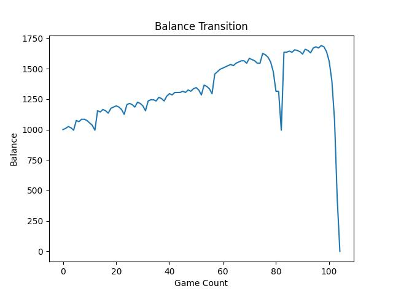
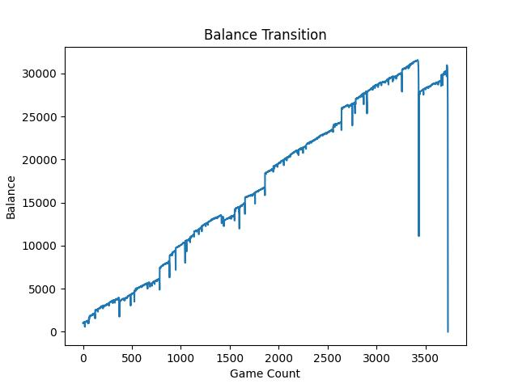
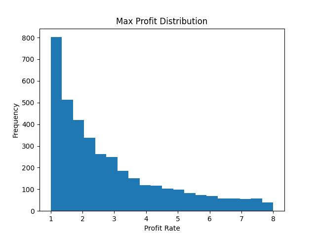

# BlackJack-Simulation
いろんな戦略を試して遊ぶ用

ラスベガスで絶対に勝つんだ！

## 結果の一部
例えば結果こんな感じ:

### 1回のブラックジャックプレイ中の残高推移
  


### 各回の瞬間最高収益率


### 瞬間最高収益率の観点から利確ラインを検討
```ini

収益率10%以上の割合: 89%
収益率30%以上の割合: 74%
収益率50%以上の割合: 64%
収益率70%以上の割合: 56%
収益率90%以上の割合: 51%
収益率110%以上の割合: 45%
収益率130%以上の割合: 41%
収益率150%以上の割合: 37%
収益率170%以上の割合: 35%
収益率190%以上の割合: 32%
収益率210%以上の割合: 30%
収益率230%以上の割合: 28%
収益率250%以上の割合: 26%
収益率270%以上の割合: 25%
収益率290%以上の割合: 23%
```
### ToDo
まだ1つしか戦略試してないので他にもいろいろ試そう

強化学習でベット戦略を自動で学習させたい
